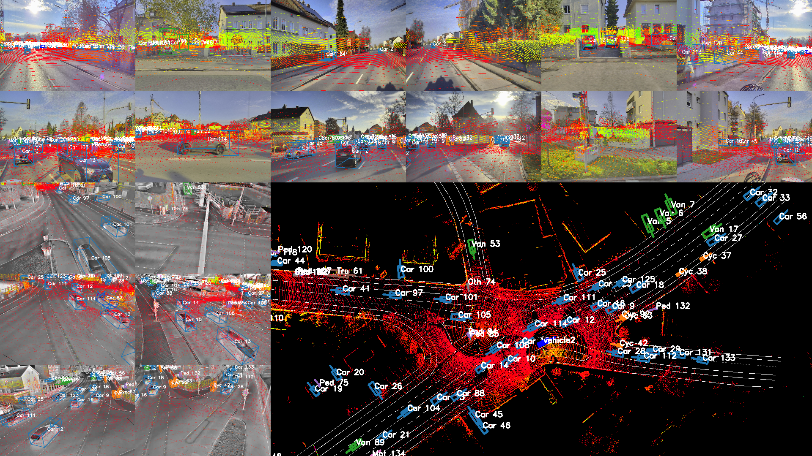

# UrbanIng-V2X: A Large-Scale Multi-Vehicle, Multi-Infrastructure Dataset Across Multiple Intersections for Cooperative Perception

This repository provides tools for dataset visualization, conversion, and training using **OpenCOOD**.  
For simplicity, two separate environments are used: one for **scripts** and one for **OpenCOOD**.


<p align="center">
  <a href="https://pypi.org/project/urbaning/" target="_blank">
    
  </a>
  <a href="https://www.arxiv.org/abs/2510.23478" target="_blank">
    
  </a>
  <a href="https://dataverse.harvard.edu/dataset.xhtml?persistentId=doi:10.7910/DVN/A9LPY7" target="_blank">
    
  </a>
</p>

---

## 📢 Announcements

Stay up to date with the latest news, updates, and important notices regarding UrbanIng-V2X:

- 2025-09-18 – Paper accepted at NeurIPS 2025 🎉

- 2025-10-23 – Dataset made publicly available on Harvard Dataverse 📦

- 2025-10-23 – Devkit released for dataset access and replicating cooperative perception benchmarks 🧰

- 2025-10-30 – PyPI package released for easier dataset access 💿

---



---
## 1️⃣ Accessing the dataset
Most easiest way to download, extract and access the dataset is via API

### 💿 Install via PyPI
```bash
pip install urbaning
```

### 📦 Downloading the dataset
```python
from urbaning.data import download_dataset, download_one_sequence
download_dataset(download_dir="datasets/UrbanIng-V2X") # to download the entire dataset
download_one_sequence(download_dir="datasets/UrbanIng-V2X") # to download only one sequence for quick start purposes - optionally pass a sequence_name
```

### 🗜️ Unzip the dataset
Note: 7zip has to be installed.
```python
from urbaning.data import unzip_dataset
unzip_dataset(dataset_folder="datasets/UrbanIng-V2X")
# If 7zip is not visible in the environment, pass also the sevenz_executable parameter
```

Dataset can also be downloaded from [here](https://dataverse.harvard.edu/dataset.xhtml?persistentId=doi:10.7910/DVN/A9LPY7).

### 🗂️ Dataset structure
```yaml
. [DATA_ROOT] # Dataset root folder
├── 📂dataset # data files
│   ├── 📂20241126_0001_crossing2_00 # sequence 1's data
│   │   ├── 📂crossing2_11_lidar # this and upcoming folders -> infrastructure lidars
│   │   │   ├── 🌫️1732632673950.npz # point cloud captured by crossing2_11_lidar at this time stamp
│   │   │   └   ...
│   │   ├── 📂crossing2_12_lidar
│   │   ├── 📂crossing2_31_lidar
│   │   ├── 📂crossing2_32_lidar
│   │   ├── 📂crossing2_13_thermal_camera # this and upcoming folders -> infrastructure cameras
│   │   │   ├── 🖼️1732632673956.jpg # image captured by crossing2_13_thermal_camera at this time stamp
│   │   │   └   ...
│   │   ├── 📂crossing2_14_thermal_camera 
│   │   ├── 📂crossing2_15_thermal_camera
│   │   ├── 📂crossing2_33_thermal_camera
│   │   ├── 📂crossing2_34_thermal_camera
│   │   ├── 📂vehicle1_back_left_camera # this and upcoming folders -> vehicle1 cameras
│   │   │   ├── 🖼️1732632674019.jpg # image captured by vehicle1_back_left_camera at this time stamp
│   │   │   └   ...
│   │   ├── 📂vehicle1_back_right_camera
│   │   ├── 📂vehicle1_front_left_camera
│   │   ├── 📂vehicle1_front_right_camera
│   │   ├── 📂vehicle1_left_camera
│   │   ├── 📂vehicle1_right_camera
│   │   ├── 📂vehicle1_middle_lidar # vehicle1 lidar
│   │   │   ├── 🌫️1732632673950.npz # point cloud captured by vehicle1_middle_lidar at this time stamp
│   │   │   └   ...
│   │   ├── 📂vehicle1_state
│   │   │   ├── 🚘1732632670000.json # state information of vehicle1 at this time stamp
│   │   │   └   ...
│   │   ├── 📂vehicle2_back_left_camera # this and upcoming folders -> vehicle2 cameras
│   │   │   ├── 🖼️1732632674019.jpg # image captured by vehicle2_back_left_camera at this time stamp
│   │   │   └   ...
│   │   ├── 📂vehicle2_back_right_camera
│   │   ├── 📂vehicle2_front_left_camera
│   │   ├── 📂vehicle2_front_right_camera
│   │   ├── 📂vehicle2_left_camera
│   │   ├── 📂vehicle2_right_camera
│   │   ├── 📂vehicle2_middle_lidar # vehicle2 lidar
│   │   │   ├── 🌫️1732632673950.npz # point cloud captured by vehicle2_middle_lidar at this time stamp
│   │   │   └   ...
│   │   ├── 📂vehicle2_state
│   │   │   ├── 🚘1732632670000.json # state information of vehicle2 at this time stamp
│   │   │   └   ...
│   │   ├── 🧭calibration.json # all intrinsic and extrinsic calibration parameters for both vehicles and infrastructures
│   │   ├── 📊timesync_info.csv # time synchronization information linking several sensor data together 
│   │   └── 📄weather_data.json # weather_data during the data collection
│   ├── 📂20241126_0004_crossing2_00
│   ├── 📂20241126_0008_crossing1_00
│   └   ...
├── 📂labels # label files
│   ├── 📄20241126_0001_crossing2_00.json # sequence 1's labels
│   ├── 📄20241126_0004_crossing2_00.json
│   ├── 📄20241126_0008_crossing1_00.json
│   └   ...
├── 📂digital_twin # carla digital twin folder
├── 📄av_vehicle_data.json # static details like track width, axle length for connected vehicles
├── 📄crossings_lanelet2map.osm # HD Lanelet map of the crossings
└── 📄labels_av_track_ids.json # track IDs of connected vehicles in the labels
```

### 🔓 Accessing the data
```python
from urbaning import Dataset
# root folder where the dataset is downloaded and unzipped
root_folder = "datasets/UrbanIng-V2X"
# load the complete dataset
dataset = Dataset(root_folder)
# number of total sequences
print(len(dataset))
```

### 🎞️ Accessing a sequence
```python
# use indexing from the dataset
index = 10
# a Sequence instance
print(type(dataset[index]))
# or simple iterate over the dataset
for sequence in dataset:
    print(sequence.sequence_name)
    break

# you can also load one sequence manually
from urbaning.data import Sequence
# sequence to load
sequence_name = "20241126_0017_crossing1_00"
# load the sequence
sequence = Sequence(root_folder, sequence_name)
```

### 🖼️ Accessing a frame
```python
# use indexing from the sequence
index = 115
# a Frame instance
print(type(sequence[index]))
# or simple iterate over the sequence
for frame in sequence:
    # this frame timestamp
    print(frame.timestamp)
    break
```

For more information on how to access the dataset, check out the [tutorial.ipynb](https://github.com/thi-ad/UrbanIng-V2X/blob/main/tutorial.ipynb) file.

---

## 2️⃣ Cooperative perception models - benchmark evaluation
To replicate the results provided in the paper.

### 🧬 Clone the repository
```bash
git clone https://github.com/thi-ad/UrbanIng-V2X.git
cd UrbanIng-V2X
```

### 🔁 OpenCOOD format conversion
We use the [OpenCOOD](https://github.com/DerrickXuNu/OpenCOOD) framework to evaluate our UrbanIng-V2X dataset on cooperative perception models.
Please download the dataset and unzip by following the above description.
To convert the dataset to OpenCOOD format:

```python
from urbaning.converters import urbaning_to_opencood_format
urbaning_to_opencood_format(source_folder="datasets/UrbanIng-V2X", target_folder="datasets/UrbanIng-V2X-OpenCOOD-format")
```

### 🧾 OpenCOOD environment
Used for training and inference using the OpenCOOD framework (Python 3.9)
Navigate to *UrbanIng-V2X/opencood*.

```bash
# Create environment
conda env create -f opencood/environment.yml
conda activate UrbanIng_v2x

# Install PyTorch
conda install pytorch==1.12.0 torchvision==0.13.0 cudatoolkit=11.3 -c pytorch -c conda-forge

# Install other dependencies
pip install -r opencood/requirements.txt
python opencood/setup.py develop

# Install spconv 2.x
pip install spconv-cu113

# Build CUDA NMS extension
python opencood/utils/setup.py build_ext --inplace
```

### ✂️ Create dataset splits
Use these splits to match the experiment settings explained in the paper
```bash
python scripts/create_opencood_splits.py
```

### 🏋️ Training OpenCOOD
Navigate to *UrbanIng-V2X/opencood*.
```bash
python opencood/tools/train.py --hypes_yaml opencood/hypes_yaml/your-config.yaml --half
```
- Replace xxxx.yaml with your configuration file.
- `--half`:  Enables mixed precision training (optional).

### 🔍 Inference OpenCOOD
Navigate to *UrbanIng-V2X/opencood*.
```bash
python opencood/tools/inference.py \
  --model_dir ${CHECKPOINT_FOLDER} \
  --fusion_method ${FUSION_STRATEGY} \
  [--show_vis] [--show_sequence]
```

- `--show_vis`: Enable visualization
- `--show_sequence`: Show sequential frame results

### 💡 Tips

- Keep dataset paths absolute to avoid errors.

- Ensure CUDA is properly installed for training and NMS compilation.

- Use separate environment for OpenCOOD to prevent dependency conflicts.

---

## 📝 License

- **Code**: Licensed under the **MIT** License. See [LICENSE](LICENSE) file
 for details.

- **Dataset**: Licensed under the Creative Commons Attribution 4.0 International [CC BY-NC-ND 4.0](https://creativecommons.org/licenses/by-nc-nd/4.0/deed.en). You must give appropriate credit; Cannot be used for commercial purposes; You may not distribute modified versions of the dataset.
--- 

## 📖 Citation
If you use UrbanIng-V2X in your research, please cite:
```bibtex
@misc{urbaningv2x2025,
  title={UrbanIng-V2X: A Large-Scale Multi-Vehicle, Multi-Infrastructure Dataset Across Multiple Intersections for Cooperative Perception},
  author={Karthikeyan Chandra Sekaran and Markus Geisler and Dominik Rößle and Adithya Mohan and Daniel Cremers and Wolfgang Utschick and Michael Botsch and Werner Huber and Torsten Schön},
  year={2025},
  eprint={2510.23478},
  archivePrefix={arXiv},
  primaryClass={cs.CV},
  url={https://arxiv.org/abs/2510.23478},
}
```
